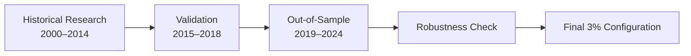
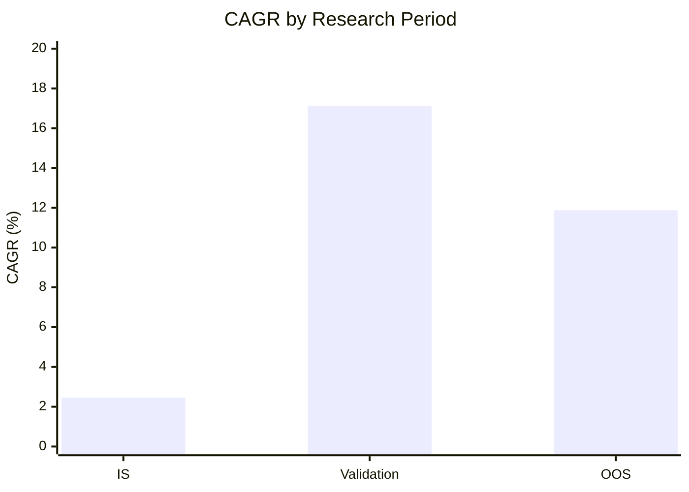
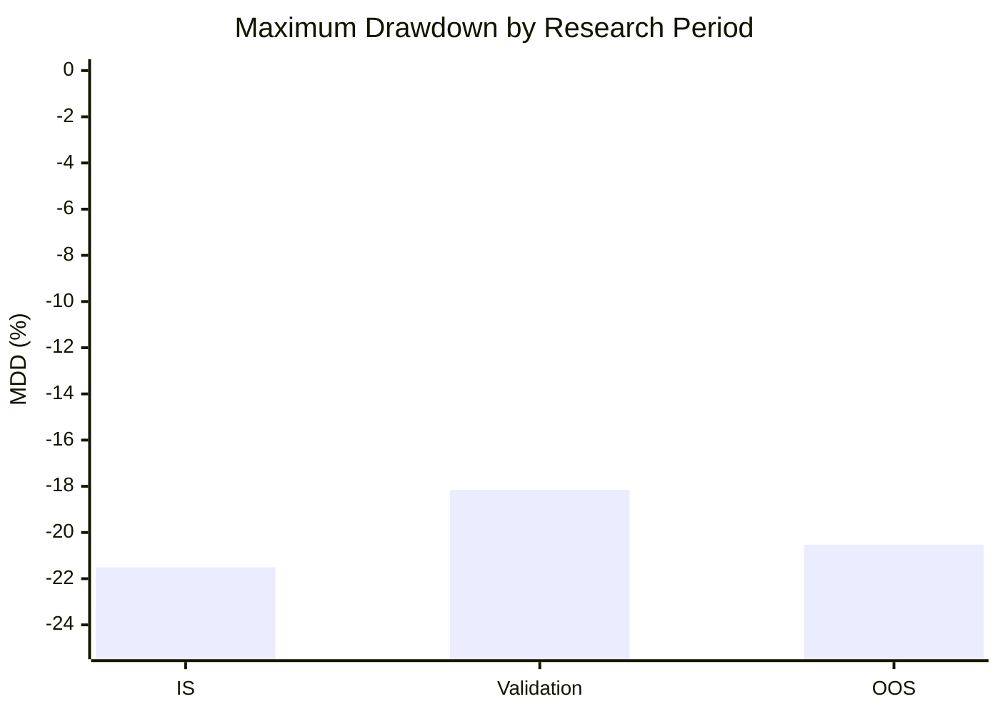

um bro i make an error so i re make it see you later :D
(and i am not smart..)

yay i make new!
(pls no error. pls.)
(2026-10-08)

# (this is NO TR, and NO SHORT only long and exit. and this is Hybrid Alpha . that's all.)
# Systematic S&P500-Related Portfolio Strategy

> **A systematic portfolio strategy designed around the characteristics of the S&P500, but implemented through a different portfolio construction and market-risk framework.**

## Overview

This project contains a systematic investment strategy designed to participate in long-term equity-market growth while attempting to control major drawdowns.

The strategy is **similar to the S&P500 in its broad market exposure, but is not an S&P500 index replication strategy**. The underlying implementation and decision framework are intentionally not disclosed in detail.

The purpose of this repository is to document the **research methodology, validation process, and historical performance**, rather than expose the core investment logic.

---

## Performance Summary

The strategy was evaluated using three separate periods:

- **IS (In-Sample):** 2000–2014
- **Validation:** 2015–2018
- **OOS (Out-of-Sample):** 2019–2024

| Period | Years | CAGR | MDD | Sharpe | Start Value | End Value |
|---|---:|---:|---:|---:|---:|---:|
| **IS** | 2000–2014 | **2.45%** | **-21.51%** | 0.289 | $9.79M | $14.08M |
| **Validation** | 2015–2018 | **17.11%** | **-18.15%** | 1.043 | $14.01M | $26.33M |
| **OOS** | 2019–2024 | **11.88%** | **-20.53%** | 0.739 | $26.33M | $51.62M |

### Key OOS Result

**OOS CAGR: 11.88%**

**OOS Maximum Drawdown: -20.53%**

The OOS period was not used to continuously optimize the strategy.

---

## Robustness Check

A simple one-shot robustness test was performed on the key rebound parameter.

The baseline parameter was changed from **3% to 5%** without performing a new optimization process.

| Configuration | OOS CAGR | OOS MDD | Sharpe |
|---|---:|---:|---:|
| **Baseline: 3%** | **11.88%** | **-20.53%** | 0.739 |
| **One-shot test: 5%** | **14.50%** | **-20.51%** | 0.859 |

The 3% → 5% change did **not** cause the strategy to deteriorate.

Instead, the OOS CAGR and Sharpe ratio increased while maximum drawdown remained essentially unchanged.

This provides evidence against the hypothesis that the baseline result depends extremely precisely on the 3% parameter.

Importantly, the 5% result was **not subsequently optimized again**.

The final portfolio configuration therefore remains the original **3% baseline**.

---

## Research Methodology

The research process separates development from validation:

The objective is not to find the parameter that produces the highest historical return.

Instead, the objective is to determine whether a relatively simple systematic framework can remain viable across different market environments.

---

## Bias Controls

### Point-in-Time Constituents

Historical portfolio membership is reconstructed using **Point-in-Time information**.

This is intended to prevent **survivorship bias** caused by using today's successful companies as if they had always been members of the historical index.

Historical constituent information is therefore treated according to the information that would have been available at the relevant point in time.

### Look-Ahead Bias

The portfolio construction process also uses **Point-in-Time information and explicit effective dates**.

Historical information is not assumed to have been available before its actual observation/effective date.

This prevents future constituent information from being used to make earlier investment decisions.

---

## Transaction Assumptions

The backtest incorporates the following assumptions:

| Parameter | Assumption |
|---|---:|
| Initial Capital | $10,000,000 |
| Transaction Fee | 0.20% |
| Slippage | 0.10% |
| Cash Interest | 2.00% annually |
| Portfolio Structure | 2-stock concentrated portfolio |
| Baseline Rebound Parameter | 3% |

These assumptions are applied consistently throughout the backtest.

---

## Performance by Research Stage

### Maximum Drawdown

The most important observation is that the OOS drawdown remained in a similar range to the earlier research periods rather than expanding dramatically after leaving the development sample.

---

## Strategy Characteristics

The strategy can be broadly described as:

- **S&P500-related**
- Systematic
- Concentrated
- Long-term oriented
- Designed with explicit drawdown considerations
- Tested across multiple historical regimes
- Uses Point-in-Time historical information
- Includes transaction costs and slippage
- Avoids continuous parameter optimization

The exact portfolio-selection and market-risk logic is intentionally not disclosed.

> **The strategy is similar to the S&P500 in overall market context, but uses a different systematic framework.**

---

## Final Configuration

After the research and robustness testing, the strategy was **frozen**.

### Final baseline

**Rebound parameter: 3%**

The 5% experiment was conducted solely as a robustness test and was **not adopted as a new optimized parameter**.

No further parameter tuning is intended for the current version.

---

## Conclusion

The main objective of this project is not to present a historically perfect backtest.

Instead, the goal is to demonstrate that a relatively simple systematic portfolio framework can:

1. Survive multiple historical market environments.
2. Produce a positive OOS result.
3. Maintain a materially lower drawdown than an unrestricted concentrated equity portfolio might experience.
4. Remain reasonably stable when a key parameter is changed.
5. Avoid survivorship and look-ahead bias through Point-in-Time methodology.
6. Avoid continuous optimization after observing OOS performance.

The current version is therefore considered **research-complete and frozen**.

> **Final baseline: 3% configuration**
>
> **OOS CAGR: 11.88%**
>
> **OOS MDD: -20.53%**
>
> **OOS Sharpe: 0.739**

---

## Disclaimer

This repository is provided for research and educational purposes only.

Historical backtest performance does not guarantee future results. Backtests may differ from live trading due to execution quality, liquidity, data quality, market impact, taxes, and other real-world factors.

The results presented here should not be interpreted as financial advice or a guarantee of future performance.

##I’m a 7th grader who loves creating financial algorithms. I'm completely new to the world of quant trading and stock investing. Please note that this post was translated using AI.
